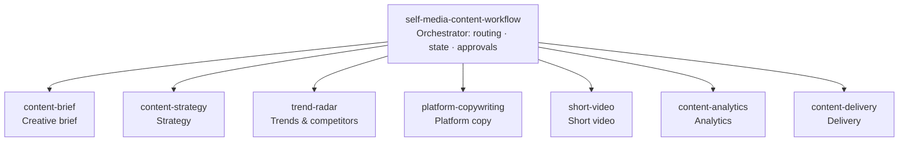

# Self Media Skills

[](https://github.com/yanhua1010/self-media-content-workflow/actions/workflows/validate.yml)
[](LICENSE)
[](CHANGELOG.md)

[简体中文](README.md) | **English**

A modular, tool-agnostic suite of agent skills for social-media content operations: from a vague idea to a confirmed brief, account strategy, trend and competitor research, platform-native copy, short-video packages, performance reviews, and verified delivery — the full content loop.

- **Tool-agnostic** — no binding to a specific model, browser, image, video, publishing, or analytics service; capabilities are discovered from the running environment
- **Platform-native** — one topic shares facts and evidence, while titles, openings, structure, and calls to action are designed per platform
- **Human-in-the-loop** — five mandatory approval gates (direction, platforms, title, final copy, publishing); drafts and publishing packages by default, never automatic broadcasting
- **Evidence-first** — every key number needs a source; facts, opinions, inferences, and advice stay separated; no fabricated data, experience, or results

## Architecture



| Skill | Responsibility |
|---|---|
| [`self-media-content-workflow`](skills/self-media-content-workflow/SKILL.md) | Request routing, state management, approvals, and end-to-end orchestration |
| [`self-media-content-brief`](skills/self-media-content-brief/SKILL.md) | Audience, goal, evidence, angle, tone, and constraints |
| [`self-media-content-strategy`](skills/self-media-content-strategy/SKILL.md) | Positioning, content mix, series, topic pool, and calendar |
| [`self-media-trend-radar`](skills/self-media-trend-radar/SKILL.md) | Trend tracking, keyword research, competitor teardowns, and original topics |
| [`self-media-platform-copywriting`](skills/self-media-platform-copywriting/SKILL.md) | Native copy for X, Xiaohongshu, WeChat, and short-video platforms |
| [`self-media-short-video`](skills/self-media-short-video/SKILL.md) | Hooks, spoken script, storyboard, captions, and shoot plan |
| [`self-media-content-analytics`](skills/self-media-content-analytics/SKILL.md) | Data quality, comparable baselines, attribution, decisions, and experiments |
| [`self-media-content-delivery`](skills/self-media-content-delivery/SKILL.md) | Milestone files, versions, path verification, and publishing packages |

## Quick start

### Install

Use the official [skills CLI](https://github.com/vercel-labs/skills) (requires Node.js):

```bash
# Install all 8 skills into the current project
npx skills add yanhua1010/self-media-content-workflow

# Install into the user-global skill directory
npx skills add yanhua1010/self-media-content-workflow -g
```

Install a subset with `--skill <name>`, and target specific agents (Claude Code, Codex, Cursor, and more) with `-a`:

```bash
npx skills add yanhua1010/self-media-content-workflow --skill self-media-content-workflow -a claude-code
```

### First task

Start from the orchestrator; it routes to the modules it needs:

```text
Use $self-media-content-workflow to turn this product-failure story into an X thread and a Xiaohongshu carousel.
```

Modules can also be invoked directly:

```text
Use $self-media-content-strategy to build a topic pool and a one-month calendar for a new account.

Use $self-media-trend-radar to research the most-asked questions about AI coding content in the last month.

Use $self-media-content-analytics to review these 10 posts and identify the single next experiment.
```

> The exact skill-invocation syntax depends on your agent.

## Workflow

```text
Clarify → Direction approval* → Research & evidence → Platform approval* → Preflight
→ Platform-native draft → Title approval* → Assets → Quality gates
→ Final-copy approval* → Publishing authorization* → Draft or publishing package → Review
```

`*` marks a mandatory human approval gate. Final-copy approval is not publishing authorization: skills create drafts or manual publishing packages by default and never broadcast.

## Safety boundaries

- No automated competitor scraping with a creator's primary account session
- No automatic likes, comments, follows, DMs, or publishing
- No cookies, tokens, or secrets in task cards, logs, or the repository
- Stop immediately on CAPTCHAs, rate limits, or platform risk controls
- Verify recent products, prices, versions, and platform rules against official sources
- Never invent data, experience, revenue, user feedback, or test results

See [SECURITY.md](SECURITY.md) for the full policy.

## Validation

```bash
python3 scripts/validate.py
```

The validator checks skill frontmatter, directory consistency, core-file length, UI metadata, relative links, and unresolved TODOs, with no third-party dependencies. CI runs the structural validation on every push and performs a real installation test with the official skills CLI.

## Repository layout

```text
skills/                   # 8 independently installable skills
├── <skill>/SKILL.md      #   core workflow (≤ 500 lines)
├── <skill>/references/   #   detailed platform guidance
└── <skill>/assets/       #   copyable output templates
scripts/validate.py       # repository validation
.github/workflows/        # structural validation + install test
```

## Design decisions

- One orchestrator owns routing and state; seven modules each own a single responsibility
- Collection and publishing are runtime adapter layers, never vendor-bound
- Platforms share facts and evidence while titles, openings, structure, and actions are rewritten per platform
- Platform limits change; exact values defer to official documentation or the publishing interface

## Contributing

Issues and pull requests are welcome. Read [CONTRIBUTING.md](CONTRIBUTING.md) and run `python3 scripts/validate.py` before submitting. See [CHANGELOG.md](CHANGELOG.md) for release history.

## License

[MIT](LICENSE)
